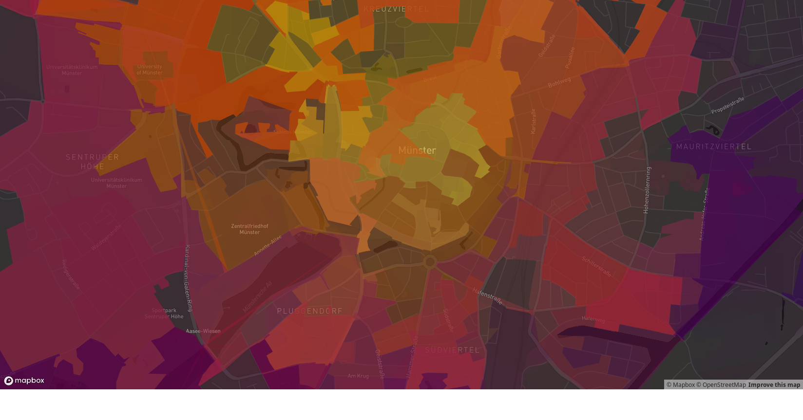
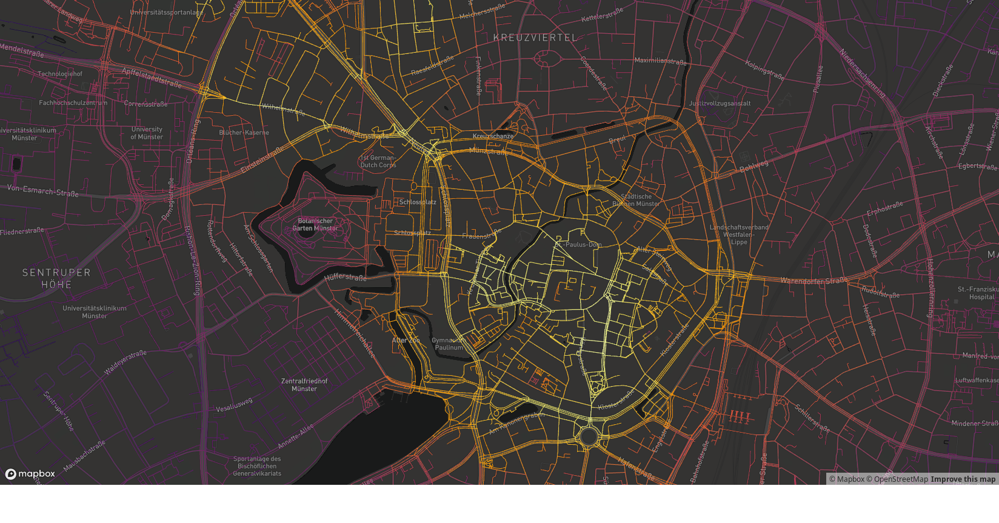

<!-- README.md is generated from README.Rmd. Please edit that file -->
<!-- badges: start -->

[](https://github.com/moveability/moveability/actions)
[](https://app.codecov.io/gh/moveability/moveability)
[](http://www.repostatus.org/#concept)
<!-- badges: end -->

# moveability: walkability and cycleability metrics for global cities

## Warning: Currently experimental only

Open-source engine to calculate comprehensive moveability statistics for
a global cities. Moveability is intended to connote any means by which
people might actively move themselves, primarily implying walking and
cycling, but also potentially skating, scootering, wheelchairing, or any
other conceivable form of active transport.

## Usage

Currently only one function that works like this:

``` r
library (moveability)
verts <- moveability (city = "muenster germany")
```

The function does a heap of heavy work, downloading the entire street
network and calculating routes between every single pair of points in
the network. This is likely to take quite some time - at least several
minutes - but will provide progress information on the way. The result
is a `data.frame` of all points in the street network for the nominated
city, with a column `$m` quantifying moveability.

The result can be directly viewed with
[`mapdeck`](https://github.com/SymbolixAU/mapdeck) with the following
code:

``` r
library (mapdeck)
set_token (Sys.getenv ("MAPBOX_TOKEN"))
loc <- c (mean (verts$x), mean (verts$y))
verts$m <- 20 * verts$m / max (verts$m)
mapdeck (style = 'mapbox://styles/mapbox/dark-v9',
         zoom = 12,
         location = loc) %>%
    add_pointcloud (data = verts,
              layer_id = "walkability",
              lon = "x",
              lat = "y",
              radius = 10,
              fill_colour = "m",
              palette = "inferno")
```


or the same thing plotted as polygons of city blocks



and finally projected back on to the street network, repeating full code
to demonstrate how

``` r
streetnet <- dodgr::dodgr_streetnet (bbox = "münster de", expand = 0.05) %>%
    dodgr::weight_streetnet (wt_profile = "foot") # or whatever
m <- moveability (streetnet = streetnet)
lsf <- moveability_to_lines (m, streetnet) # sf-format linestrings
# add "width" for plotting:
lsf$width <- sqrt (lsf$flow * 10 / max (lsf$flow))

library (mapdeck)
set_token (Sys.getenv ("MAPBOX_TOKEN"))
loc <- colMeans (do.call (rbind, l$geometry))
mapdeck (style = 'mapbox://styles/mapbox/dark-v9',
         zoom = 12,
         location = loc) %>%
    add_path (data = lsf,
              stroke_colour = "flow",
              stroke_width = "width",
              palette = "inferno")
```


